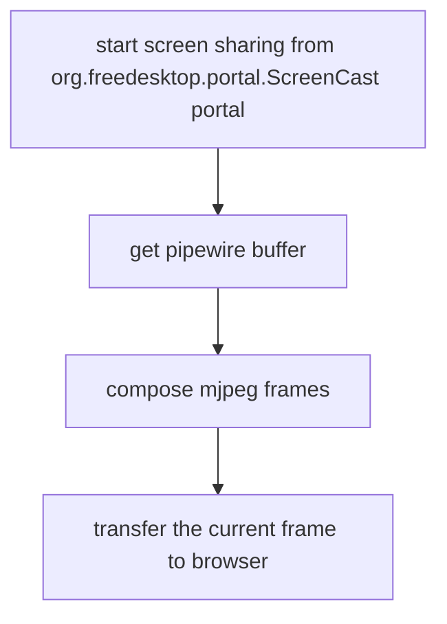

# cerve

An HTTP server written in c.
Nothing special, just a personal project!

# Plan changes

# Cerve -> CerveM

- now we are doing something cool
- do a simple terminal tool to share your screen locally over http

0. check if feasible to share the video without any html / otherwise do that as well
1. find ways to get src video
2. find codecs and supporting libraries (or even try to do it by hand ;)
3. That's it! make a talk about it in KochiFoss!

**Going with MJPEG Stream, and freedesktop portel**

# Requirements

To build

# Flow

# Note Dump

gdbus call --session            --dest org.freedesktop.portal.Desktop            --object-path /org/freedesktop/portal/desktop            --method org.freedesktop.portal.Screenshot.Screenshot            "{}" "{'filename': <'/home/bruttazz/screenshot.png'>, 'interactive': <false>}"
