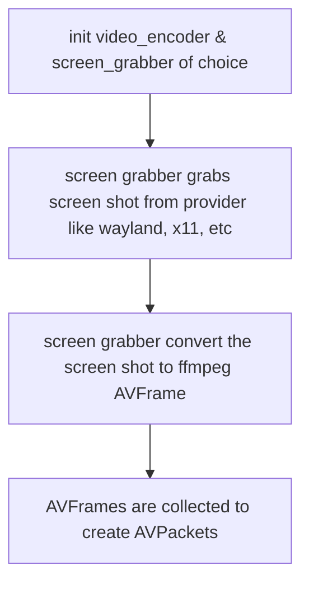

# cerve

An HTTP server written in c.
Nothing special, just a personal project!

# Plan changes

# Cerve -> CerveM

- now we are doing something cool
- do a simple terminal tool to share your screen locally over http

0. check if feasible to share the video without any html / otherwise do that as well
1. find ways to get src video
2. find codecs and supporting libraries (or even try to do it by hand ;)
3. That's it! make a talk about it in KochiFoss!

# Okay I am only going with Wayland

1. now grab some screen images from wayland
2. That implies this is only for GNU/Linux

# Requirements

To build

1. ffmpeg-dev / ffmpeg-free-devel (in fedora repo)
2. wayland-dev / wayland-devel

# Flow

